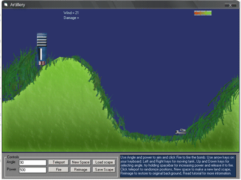



## Artillery tanks \+ Coordination tutorial

### Description

This is a very unique style artillery game. I first coded it in GW-BASIC but now I have made more changes and added more features. You have to give angle and power as inputs. and the tank will throw a ball which flies and hits the target. The wind pressure also effects the ball. Random land generate feature generates the land randomly and gives the tank and target a random position. The coordination tutorial is included. The tutorial is easy to learn. Every thing is expressed and explained in it. The throwing of ball, the arcing, trignometery in VB, Wind effect, etc are explained in detail.
 
### More Info
 

             |
---                |---
**Submitted On**   |2008-06-03 09:05:42
**By**             |[Xelon Labs](https://github.com/Planet-Source-Code/PSCIndex/blob/master/ByAuthor/xelon-labs.md)
**Level**          |Intermediate
**User Rating**    |5.0 (20 globes from 4 users)
**Compatibility**  |VB 5\.0, VB 6\.0
**Category**       |[Math/ Dates](https://github.com/Planet-Source-Code/PSCIndex/blob/master/ByCategory/math-dates__1-37.md)
**World**          |[Visual Basic](https://github.com/Planet-Source-Code/PSCIndex/blob/master/ByWorld/visual-basic.md)
**Archive File**   |[Artillery\_211491632008\.zip](https://github.com/Planet-Source-Code/xelon-labs-artillery-tanks-coordination-tutorial__1-70631/archive/master.zip)

